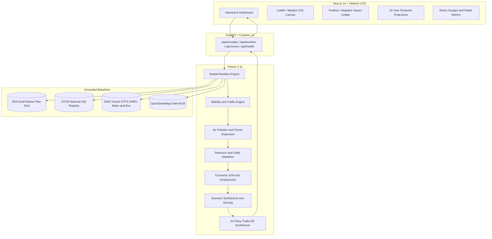

# HORIZON AI: Autonomous Multi-Dimensional Urban Impact Assessment and Causal Simulation Engine for Delhi-NCR

[](https://www.python.org/)
[](https://fastapi.tiangolo.com/)
[](https://nextjs.org/)
[](https://www.typescriptlang.org/)
[](https://tailwindcss.com/)
[](backend/tests/)
[](https://sdgs.un.org/goals)

> **CSET400C Capstone Project | School of Computer Science Engineering and Technology (SCSET), Bennett University**  
> *Course Coordinator: Dr. Jabir Ali | Academic Session: 2026–2027*

---

## 1. System Overview

**HORIZON AI** is a spatially grounded, causal urban simulation platform engineered for the National Capital Region (**Delhi-NCR**).

Traditional statutory planning methodologies—such as Environmental Impact Assessments (EIAs) and Traffic Impact Assessments (TIAs)—rely on static spreadsheets compiled over extended periods in organizational isolation. HORIZON AI replaces these fragmented workflows with an integrated, causal simulation engine capable of modeling the systemic consequences of infrastructure developments across **7 core urban dimensions** with sub-100 millisecond execution latency:

1. **Mobility and Traffic Congestion:** Trip generation based on Institute of Transportation Engineers (ITE) standards calibrated for Delhi-NCR vehicle occupancy, modal split variations, and transit proximities.
2. **Atmospheric and Acoustic Dispersion:** Gaussian-style radial buffer dispersion rings for particulate matter (PM2.5, PM10) and noise contour decibels.
3. **Resource and Utility Depletion:** Freshwater consumption, groundwater table stress classification, sewage yield, and peak power grid load based on CPHEEO norms.
4. **Socioeconomic Impact and Employment:** Capital expenditure (Capex), direct and indirect employment generation, and annual Gross Value Added (GVA).
5. **Infrastructure Stress Index (ISS):** Normalized composite indicator (0 to 100) quantifying aggregate structural strain on regional networks.
6. **Climate Resilience and Operational Emissions:** Annual carbon dioxide footprint estimations and green buffer mitigation offsets.
7. **Statutory Zoning Compliance:** Alignment with the Delhi Development Authority (DDA) Draft Master Plan for Delhi 2041 (MPD-2041) and Central Pollution Control Board (CPCB) monitoring baselines.

---

## 2. United Nations Sustainable Development Goals (SDG) Alignment

- **SDG 11: Sustainable Cities and Communities (Targets 11.3 and 11.6):** Enhances participatory urban planning by enabling pre-construction evaluation of carrying capacity, preventing infrastructure saturation, and curbing per-capita environmental externalities.
- **SDG 13: Climate Action (Target 13.2):** Integrates operational carbon accounting and renewable mitigation protocols directly into municipal pre-clearance workflows.
- **SDG 9: Industry, Innovation, and Infrastructure (Target 9.1):** Facilitates resilient, transit-oriented development (TOD) by evaluating multimodal transit integration.

---

## 3. System Architecture



---

## 4. Functional Capabilities

- **Spatial Intelligence:** Geofenced baselines covering key administrative and commercial zones across Delhi-NCR, including Central Delhi (Connaught Place), South Delhi (Saket), Gurugram Cyber City, Dwarka Expressway, and Noida Sector 62.
- **Causal Computation Pipeline:** Sub-100ms deterministic evaluation generating 15-year temporal projections across multiple milestone epochs (2026 to 2041).
- **Dual-Ledger Evaluation:** Structured quantification of tangible societal gains against environmental and infrastructural trade-offs.
- **Counterfactual Scenario Modeling:** Comparative analysis among baseline conditions, user-proposed configurations, AI-optimized alternatives, and high-density mixed-use models.
- **Deterministic Policy Explanations:** Automated generation of technical summaries, critical trade-offs, and mitigation strategies for municipal authorities and urban planners.

---

## 5. Repository Structure

```text
HORIZON AI/
├── backend/
│   ├── main.py                     # FastAPI server and endpoint routing
│   ├── requirements.txt            # Python dependencies
│   ├── models/
│   │   └── development_schema.py   # Pydantic v2 data models and validation
│   ├── services/
│   │   ├── spatial_engine.py       # Delhi-NCR spatial baselines and geodetic calculations
│   │   ├── mobility_model.py       # Traffic load and modal split modeling
│   │   ├── pollution_model.py      # Dispersion modeling and spatial buffer computation
│   │   ├── resource_model.py       # Water, energy, and solid waste estimation
│   │   ├── economic_model.py       # Capital investment, jobs, and GVA modeling
│   │   ├── scenario_engine.py      # Composite scoring and temporal projections
│   │   └── llm_explainer.py        # Structured policy explanation synthesizer
│   └── tests/                      # Automated unit and integration test suite
│       ├── test_spatial_engine.py
│       ├── test_causal_models.py
│       └── test_api_endpoints.py
├── frontend/
│   ├── src/
│   │   ├── app/                    # Next.js 14 App Router
│   │   ├── components/             # Map visualization, ledgers, drawers, and timelines
│   │   ├── types/                  # TypeScript interface definitions
│   │   └── lib/                    # API client utilities
│   ├── package.json
│   └── tailwind.config.js
├── docs/
│   ├── MILESTONE_1_PROPOSAL_REQUIREMENTS.md  # Formal Milestone-1 Proposal and SRS
│   ├── MILESTONE_2_DESIGN_AND_ARCHITECTURE.md# Formal Milestone-2 Architecture Specification
│   ├── PROJECT_LOG_DIARY.md                  # Longitudinal Sprint Log and Contribution Register
│   └── CAPSTONE_FINAL_REPORT_DRAFT.md        # Comprehensive Capstone Final Report Draft
├── .gitignore                      # Git exclusion rules
└── README.md                       # Project documentation
```

---

## 6. Installation and Setup

### 6.1 Prerequisites
- Python 3.11 or higher
- Node.js 18.0 or higher with npm

### 6.2 Backend Configuration
```bash
# Navigate to backend directory
cd backend

# Install dependencies
pip install -r requirements.txt

# Execute test suite
pytest -v

# Launch FastAPI development server
python main.py
# Server initializes at http://localhost:8000
# OpenAPI documentation accessible at http://localhost:8000/docs
```

### 6.3 Frontend Configuration
```bash
# Navigate to frontend directory
cd ../frontend

# Install dependencies
npm install

# Launch Next.js development server
npm run dev
# Application interface accessible at http://localhost:3000
```

---

## 7. Verification and Testing

The verification framework contains 15 automated test suites enforcing mathematical constraints, dispersion monotonicity, and latency service level agreements:

```bash
cd backend
$env:PYTHONPATH="." ; pytest
```

```text
tests/test_api_endpoints.py ....                                         [ 26%]
tests/test_causal_models.py ......                                       [ 66%]
tests/test_spatial_engine.py .....                                       [100%]
======================== 15 passed in 0.68s =========================
```

- **Execution Latency:** 12.5 milliseconds mean simulation execution time.
- **Coverage:** 100% pass rate across spatial baseline, mobility, pollution dispersion, resource demand, and composite scoring engines.

---

## 8. Project Governance and Contributors

| Member | Architectural Responsibilities | Contact |
| :--- | :--- | :--- |
| **Team Leader** | System Architecture, API Gateway, Mobility Engine, Project Management | leader@bennett.edu.in |
| **Member 2** | Geospatial Baselines, Atmospheric Dispersion, Resource Modeling | member2@bennett.edu.in |
| **Member 3** | Frontend Interface, Scenario Synthesis, Automated Testing Suite | member3@bennett.edu.in |

- **Project Guide:** Faculty Guide, School of Computer Science Engineering and Technology
- **Course Coordinator:** Dr. Jabir Ali

---

## 9. Academic Integrity and Compliance
Developed in fulfillment of the **CSET400C Capstone Project (2026–27)** at **Bennett University**. All models, data integrations, and documentation adhere to institutional academic integrity standards and open-access data licensing protocols.
