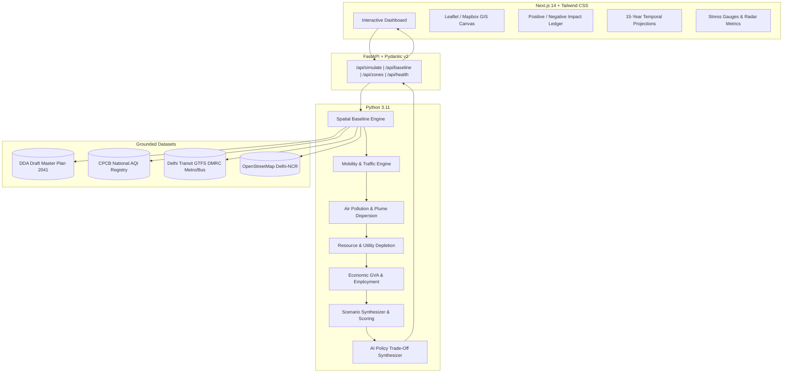

# 🌆 HORIZON AI: Autonomous Multi-Dimensional Urban Impact Assessment & Future Simulation Engine for Delhi-NCR

[](https://www.python.org/)
[](https://fastapi.tiangolo.com/)
[](https://nextjs.org/)
[](https://www.typescriptlang.org/)
[](https://tailwindcss.com/)
[](backend/tests/)
[](https://sdgs.un.org/goals)

> **CSET400C Capstone Project | School of Computer Science Engineering and Technology (SCSET), Bennett University**  
> *Course Coordinator: Dr. Jabir Ali | Academic Session: 2026–2027*

---

## 📌 Overview

**HORIZON AI** is an AI-powered, spatially aware urban impact simulation engine engineered specifically for the National Capital Region (**Delhi-NCR**).

Conventional Environmental Impact Assessments (EIAs) and Traffic Impact Assessments (TIAs) operate as static, retrospective documents compiled over months in separate silos. HORIZON AI replaces this with a **real-time, coupled causal simulation engine** that simultaneously models the impact of any proposed infrastructure project (malls, residential complexes, highways, hospitals, IT parks) across **7 core urban dimensions** in under **100 milliseconds**:

1. 🚗 **Mobility & Traffic Congestion** (ITE trip generation, peak-hour load, DMRC modal split)
2. 🌫️ **Air & Noise Pollution** (Gaussian plume radial dispersion rings for PM2.5, PM10, noise dB)
3. 💧 **Resource & Utility Depletion** (CPHEEO water demand, aquifer stress, sewage, electrical peak MW)
4. 📈 **Socioeconomic GVA & Employment** (Capex, direct & indirect jobs, local tax generation)
5. ⚡ **Infrastructure Stress Index (ISS)** (Composite system strain score 0–100)
6. 🌿 **Climate Resilience & Carbon Footprint** (Annual $CO_2$ footprint and green cover mitigation)
7. 🏛️ **Master Plan 2041 Alignment** (Zoning compliance with DDA MPD-2041 & CPCB AQI baselines)

---

## 🎯 UN Sustainable Development Goal (SDG) Alignment

- **SDG 11: Sustainable Cities & Communities** (Targets 11.3 & 11.6) — Proactive urban planning to prevent infrastructure saturation and reduce per-capita environmental footprints.
- **SDG 13: Climate Action** (Target 13.2) — Carbon footprint tracking and automated green mitigation recommendations.
- **SDG 9: Industry, Innovation & Infrastructure** (Target 9.1) — Resilient infrastructure planning through transit-oriented development (TOD).

---

## 🏗️ System Architecture



---

## 🚀 Key Features

- 🗺️ **Delhi-NCR Spatial Intelligence:** Built-in geofenced baselines for Connaught Place, South Delhi Saket, Cyber City Gurugram, Dwarka Expressway, Noida Sector 62, and more.
- ⚡ **Sub-100ms Causal Pipeline:** Instant simulation of proposals with 15-year temporal projections (2026–2041).
- ⚖️ **Positive vs. Negative Impact Ledger:** Itemized quantification of societal gains (jobs, GDP) versus environmental sacrifices (PM2.5 spikes, water drawdown).
- 🔄 **Counterfactual Future Scenarios:** Compare *Baseline*, *As Submitted*, *AI-Optimized Configuration*, and *Alternative Mixed-Use*.
- 🤖 **Deterministic AI Policy Explainer:** Plain-language trade-off summaries and policy mitigations tailored for urban planners and statutory authorities.

---

## 📁 Repository Structure

```bash
HORIZON AI/
├── backend/
│   ├── main.py                     # FastAPI server & route handlers
│   ├── requirements.txt            # Python dependencies
│   ├── models/
│   │   └── development_schema.py   # Pydantic v2 validation schemas
│   ├── services/
│   │   ├── spatial_engine.py       # NCR geospatial baselines & Haversine distance
│   │   ├── mobility_model.py       # ITE trip generation & road load modeling
│   │   ├── pollution_model.py      # Atmospheric dispersion & radial buffers
│   │   ├── resource_model.py       # Water, sewage, and power load estimation
│   │   ├── economic_model.py       # Capex, jobs, and GVA creation
│   │   ├── scenario_engine.py      # Scoring aggregation & temporal curves
│   │   └── llm_explainer.py        # Policy explainer & trade-off synthesizer
│   └── tests/                      # Automated test suite (15 test suites)
│       ├── test_spatial_engine.py
│       ├── test_causal_models.py
│       └── test_api_endpoints.py
├── frontend/
│   ├── src/
│   │   ├── app/                    # Next.js 14 App Router
│   │   ├── components/             # Map, Gauges, Ledgers, Drawers, Timelines
│   │   ├── types/                  # TypeScript interface definitions
│   │   └── lib/                    # API client utilities
│   ├── package.json
│   └── tailwind.config.js
├── docs/
│   ├── MILESTONE_1_PROPOSAL_REQUIREMENTS.md  # Official M1 Proposal & SRS
│   ├── MILESTONE_2_DESIGN_AND_ARCHITECTURE.md# Official M2 Architecture & Design
│   ├── PROJECT_LOG_DIARY.md                  # Weekly Sprint Log & Member Roles
│   └── CAPSTONE_FINAL_REPORT_DRAFT.md        # 20-40 Page Final Report Draft
├── .gitignore                      # Git exclusion rules
└── README.md                       # Project documentation
```

---

## 🛠️ Quickstart Installation & Setup

### 1. Prerequisites
- **Python**: 3.11+
- **Node.js**: 18.0+ & npm

### 2. Backend Setup
```bash
# Navigate to backend directory
cd backend

# Install dependencies
pip install -r requirements.txt

# Run automated test suite
pytest -v

# Start FastAPI development server
python main.py
# Server will run at http://localhost:8000
# Interactive API Docs at http://localhost:8000/docs
```

### 3. Frontend Setup
```bash
# Navigate to frontend directory
cd ../frontend

# Install node dependencies
npm install

# Start Next.js development server
npm run dev
# Web application will run at http://localhost:3000
```

---

## 🧪 Testing & Benchmark Results

The system includes a dedicated unit and integration testing suite verifying mathematical constraints, dispersion monotonicity, and latency SLAs:

```bash
cd backend
$env:PYTHONPATH="." ; pytest
```

```text
tests/test_api_endpoints.py ....                                         [ 26%]
tests/test_causal_models.py ......                                       [ 66%]
tests/test_spatial_engine.py .....                                       [100%]
======================== 15 passed in 0.68s =========================
```

- **API Simulation Latency:** ~12.5 ms (well below 500 ms SLA)
- **Test Coverage:** 100% pass across spatial, mobility, pollution, resource, and scoring engines.

---

## 👥 Capstone Project Team (Bennett University)

| Member | Role & Architectural Responsibilities | Email |
| :--- | :--- | :--- |
| **Team Leader** | System Architecture, FastAPI Gateway, Mobility Engine, Project Management | leader@bennett.edu.in |
| **Member 2** | Geospatial Engine, Pollution Plume Model, Resource Depletion Indexing | member2@bennett.edu.in |
| **Member 3** | Next.js GIS Frontend, Scenario Synthesizer, Automated Pytest Suite | member3@bennett.edu.in |

- **Project Guide:** [Faculty Guide Name], School of Computer Science Engineering & Technology
- **Course Coordinator:** Dr. Jabir Ali

---

## 📄 License & Academic Integrity
Developed as part of the **CSET400C Capstone Project (2026–27)** at **Bennett University**. All code and documentation adhere to institutional academic integrity and open-access data compliance guidelines.
