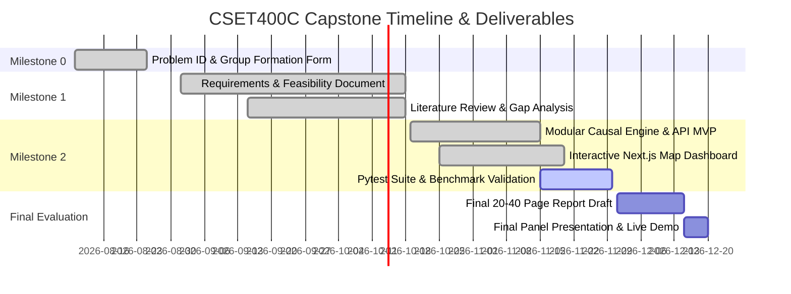

# CSET400C Capstone Project — Milestone-1 Report
**Bennett University | School of Computer Science Engineering and Technology**  
**Course Code:** CSET400C (0-0-12-6) | **Academic Session:** 2026–27  
**Course Coordinator:** Dr. Jabir Ali  

---

## Project Title: HORIZON AI
### Autonomous Multi-Dimensional Urban Impact Assessment & Future Simulation Engine for Delhi-NCR

- **Group ID:** *(Assigned post M0 validation)*
- **Team Members:**
  1. Team Leader: [Name] | Enrollment No: [XXXXXXX] | Email: [leader@bennett.edu.in]
  2. Member 2: [Name] | Enrollment No: [XXXXXXX] | Email: [member2@bennett.edu.in]
  3. Member 3: [Name] | Enrollment No: [XXXXXXX] | Email: [member3@bennett.edu.in]
- **Project Guide:** [Guide Name, Designation]

---

## 1. Problem Statement & Motivation

### 1.1 Context
The National Capital Region (Delhi-NCR), spanning over 55,000 sq. km and supporting over 46 million residents, is one of the fastest-growing urban agglomerations in the world. Rapid and uncoordinated infrastructure projects (e.g., mega commercial malls, high-density residential towers, and expressways) frequently outpace the carrying capacity of municipal resources.

### 1.2 Core Problem
Currently, Environmental Impact Assessments (EIAs), Traffic Impact Assessments (TIAs), and municipal approvals are conducted:
1. **In Static Silos:** Traffic, air quality, water tables, and economic returns are evaluated by independent agencies using static, retrospective spreadsheets rather than dynamic causal models.
2. **Without Spatial Sensitivity:** Projects fail to account for micro-zoning, proximity to multimodal transit nodes (DMRC metro corridors, DTC bus hubs), or baseline aquifer stress.
3. **Without Multi-Year Forecasting:** Planners lack interactive tools to project the 5-to-15 year cumulative impacts of a project before municipal permits are granted.

### 1.3 Proposed Solution
**HORIZON AI** is an AI-driven, spatially aware urban simulation platform tailored for Delhi-NCR. It evaluates proposed developments across 7 core dimensions—**Mobility, Air Quality, Resource Stress, Economic GVA, Infrastructure Stress, Social Equity, and Climate Resilience**—generating real-time impact ledgers, 15-year temporal projections, and automated policy mitigation strategies.

---

## 2. UN Sustainable Development Goal (SDG) Alignment & Rationale

| SDG Goal | Target | Relevance & Direct Contribution of HORIZON AI |
| :--- | :--- | :--- |
| **SDG 11: Sustainable Cities & Communities** *(Primary)* | **Target 11.3 & 11.6** | • Enables participatory, integrated urban planning for municipal authorities (DDA, NCRPB, NOIDA/GNIDA, GMDA). • Reduces the per-capita adverse environmental impact of cities by simulating PM2.5, PM10, noise buffers, and municipal solid waste generation before construction. |
| **SDG 13: Climate Action** *(Secondary)* | **Target 13.2 & 13.3** | • Integrates carbon footprint and microclimate stress indicators into local development approvals. • Simulates EV transition scenarios and mandatory green canopy buffers to offset operational emissions. |
| **SDG 9: Industry, Innovation & Infrastructure** *(Supporting)* | **Target 9.1 & 9.4** | • Fosters resilient, sustainable infrastructure development through proactive infrastructure stress scoring (ISS) and transit-oriented development (TOD) alignment. |

---

## 3. Literature Review & Existing Solutions Gap Analysis

### 3.1 Review of Existing Methodologies and Tools

| Platform / Tool | Developer / Origin | Core Strengths | Critical Limitations |
| :--- | :--- | :--- | :--- |
| **ArcGIS Urban** | Esri | Comprehensive 3D zoning visualization and parcel tracking. | High enterprise licensing costs, lacks local Indian urban baselines (CPCB AQI, MPD-2041 zoning), closed-source proprietary causal models. |
| **UrbanFootprint** | UrbanFootprint Inc. | Strong scenario planning for US/North American land use. | Inapplicable to Indian polycentric agglomerations; lacks granular NCR multimodal transit and air pollution dispersion logic. |
| **Static EIA / MoEFCC Reports** | Government of India | Legally mandated compliance frameworks. | Static documents taking 6–18 months; zero interactive what-if scenario testing; no real-time dynamic trade-off analysis. |
| **Aimsun / VISSIM** | TSS / PTV Group | Microscopic traffic simulation and signal timing. | Hyper-focused on vehicular mechanics; ignores coupled effects on water security, air quality plumes, and socioeconomic GVA. |

### 3.2 The Research & Technical Gap Addressed by HORIZON AI
HORIZON AI bridges the gap between **high-level GIS visualization** and **coupled causal simulation**:
- **Causal Coupling:** Vehicle trips generated (ITE Delhi-adjusted) immediately feed into road volume-over-capacity ($V/C$) ratios, which subsequently drive idle-emission PM2.5/PM10 spikes and localized noise contour buffers.
- **Micro-Baseline Calibration:** Uses localized Delhi-NCR geospatial coordinates, DDA Master Plan 2041 land-use zones, and CPCB real-time AQI feeds.
- **Counterfactual Scenario Generator:** Automatically computes optimized scenarios (e.g., Green Transit Oriented Development vs Business as Usual) and generates human-readable policy trade-off explanations.

---

## 4. Stakeholder & Requirements Analysis

### 4.1 Stakeholder Matrix

| Stakeholder Persona | Key Needs & Pain Points | HORIZON AI Feature Mapping |
| :--- | :--- | :--- |
| **Urban Development Authorities (DDA, NCRPB, GMDA, Noida Authority)** | Need rapid pre-clearance validation against Master Plan 2041 zoning before commissioning expensive consultants. | Spatial Baseline Analyzer, Master Plan Zone Compliance Validator, Infrastructure Stress Index (ISS). |
| **Environmental Protection Boards (CPCB, DPCC)** | Need granular localized dispersion models for PM2.5 and aquifer depletion. | Multi-tier Radial Buffer Contours (100m, 300m, 500m, 1000m), Aquifer Drawdown Calculator. |
| **Real Estate & Infrastructure Developers** | Want to maximize built-up area while understanding mitigation costs and project viability. | Net Utility Score, Mitigated Scenario Recommender, Economic Job & GVA Output. |
| **Citizen & Resident Welfare Associations (RWAs)** | Require transparency regarding how a proposed commercial complex will affect their water supply and traffic delays. | Positive-Negative Impact Ledger, Plain-language AI Explainer, 15-Year Temporal Trajectories. |

### 4.2 Requirements Specification

#### Functional Requirements (FR)
- **FR-01 (Geospatial Pinpointing):** The system shall allow users to select any coordinate across Delhi-NCR or pick from predefined planning corridors (e.g., Sector 62 Noida, Dwarka Expressway, Cyber City Gurugram).
- **FR-02 (Development Parameterization):** The system shall accept development parameters: project type, gross built-up area (sq ft), floors, visitor/occupant capacity, parking spaces, green buffer (hectares), and operating hours.
- **FR-03 (Baseline Extraction):** The engine shall automatically retrieve baseline spatial indicators including land use, current AQI, water stress classification, transit proximity, and hospital/school density.
- **FR-04 (Mobility Modeling):** The system shall compute daily vehicular trip generation, modal split (private vs public transit), peak hour volume, and road capacity degradation.
- **FR-05 (Environmental Modeling):** The system shall calculate localized PM2.5, PM10, $CO_2$ operational emissions, and multi-tier noise buffers ($100m, 300m, 500m, 1000m$).
- **FR-06 (Resource Modeling):** The system shall project daily fresh water consumption (kLD), groundwater stress delta, electrical peak load (MW), and municipal solid waste generation (TPD).
- **FR-07 (Economic Modeling):** The system shall estimate direct/indirect employment generation, capital expenditure, and annual Gross Value Added (GVA in ₹ Crores).
- **FR-08 (Scoring & Aggregation):** The system shall calculate a normalized **HORIZON Score (0–100)** and an **Infrastructure Stress Index (ISS 0–100)**.
- **FR-09 (Temporal Simulation):** The system shall project 15-year trajectories for traffic, PM2.5, water stress, and net utility across 5 milestone epochs.
- **FR-10 (Counterfactual Scenarios):** The system shall synthesize 3 distinct futures: *Unmitigated Rapid Growth*, *Current Proposed Path*, and *Optimized Eco-Transit Scenario*.
- **FR-11 (AI Synthesizer & Explainer):** The system shall produce plain-language executive summaries of trade-offs, explicit sacrifices, and policy mitigations.
- **FR-12 (Interactive Dashboard):** The frontend shall present an interactive GIS map, dual positive/negative impact ledger, radar dimension charts, and temporal sliders.

#### Non-Functional Requirements (NFR)
- **NFR-01 (Performance & Latency):** Full multi-engine causal simulation shall execute and return API payload within **500 ms**.
- **NFR-02 (Modularity & Extensibility):** Backend services shall be decoupled into independent domain engines (spatial, mobility, pollution, resource, economic, scenario).
- **NFR-03 (Data Integrity & Reproducibility):** Deterministic models shall yield identical outputs given identical inputs and coordinates.
- **NFR-04 (Usability & Responsiveness):** Dashboard interface shall render seamlessly across modern desktop browsers with zero-jank map zooming and panning.
- **NFR-05 (Security & Safety):** Input validation on all numerical parameters preventing boundary overflow or code injection.

---

## 5. Feasibility Study & Risk Mitigation Matrix

### 5.1 Feasibility Assessment
1. **Technical Feasibility:** Highly viable. Backend implemented in Python (FastAPI, NumPy, Pydantic) for high-performance vectorized calculations. Frontend built with Next.js 14, React Leaflet / Mapbox GL, and Tailwind CSS.
2. **Economic Feasibility:** The core system leverages open-access geospatial datasets (OpenStreetMap, DDA Master Plan 2041 reports, CPCB Sameer open portal) and open-source libraries, ensuring zero licensing overhead.
3. **Operational Feasibility:** Municipal and urban planning bodies can integrate the API into existing pre-clearance workflows or use the standalone web dashboard.
4. **Legal & Ethical Feasibility:** Complies with open data access norms. AI explainers operate with deterministic guardrails to prevent ungrounded hallucinations in statutory planning contexts.

### 5.2 Risk Analysis and Mitigation Strategy

| Risk ID | Identified Risk | Severity | Likelihood | Mitigation Strategy |
| :--- | :--- | :---: | :---: | :--- |
| **R-01** | High latency or downtime of external live APIs (e.g. CPCB live AQI). | Medium | High | Implement a localized cached baseline registry for all 10 NCR planning zones with graceful fallback. |
| **R-02** | Over-simplification of micro-meteorological atmospheric dispersion. | Medium | Medium | Calibrate radial buffer decay rates using standard empirical Gaussian plume dispersion factors for urban Delhi. |
| **R-03** | Hallucination in LLM-generated impact summaries. | High | Low | Utilize a structured template-driven deterministic synthesis engine with verified factual injection bounds. |
| **R-04** | Discrepancies in trip generation rates between US ITE standards and Indian road conditions. | High | Low | Apply Delhi-specific vehicle occupancy multipliers and Indian modal split coefficients (two-wheelers, auto-rickshaws, metro). |

---

## 6. Proposed Methodology & Mathematical Formulations

### 6.1 Mobility Causal Formulation
Trip generation ($T_{daily}$) is computed as a function of built-up area ($A$), project typology ($\tau$), and visitor capacity ($C_{daily}$):
$$T_{daily} = \left( A \times r_{floor,\tau} \right) + \left( C_{daily} \times \alpha_{\tau} \right)$$
Peak hour trips ($T_{peak}$) and road volume-over-capacity ratio ($V/C$) update as:
$$V/C_{new} = V/C_{baseline} + \frac{T_{peak} \times (1 - \mu_{transit})}{Capacity_{road}}$$
where $\mu_{transit}$ is the transit-oriented modal split penalty factor derived from distance to nearest Metro station ($d_{metro}$).

### 6.2 Pollution & Radial Buffer Formulation
Localized incremental PM2.5 at radial distance $r \in \{100, 300, 500, 1000\}$ meters is modeled using empirical distance-decay dispersion:
$$\Delta PM2.5(r) = \left( \beta_{traffic} \cdot \Delta V_{veh} + \beta_{operational} \cdot A \right) \times \exp\left( -k \cdot r \right)$$

### 6.3 Resource Depletion Formulation
Daily freshwater demand ($Q_{water}$) in kilo-litres per day (kLD):
$$Q_{water} = \frac{C_{daily} \times q_{per\_capita,\tau}}{1000}$$
Groundwater drawdown risk is categorized as Critical if $Q_{water} > 150 \text{ kLD}$ and baseline water stress is "Critical".

### 6.4 HORIZON Score & Infrastructure Stress Index (ISS)
The composite **HORIZON Score** evaluates net positive societal utility against environmental cost:
$$\text{HORIZON Score} = \left( 0.40 \times S_{positive} + 0.60 \times (100 - S_{negative}) \right) \times \gamma_{zoning\_penalty}$$
The **Infrastructure Stress Index (ISS)** balances peak load against local grid and transport headroom:
$$\text{ISS} = w_m \cdot Stress_{mobility} + w_p \cdot Stress_{pollution} + w_w \cdot Stress_{water} + w_e \cdot Stress_{power}$$

---

## 7. Expected Deliverables & Milestones Schedule

---
*End of Milestone-1 Specification Document.*
