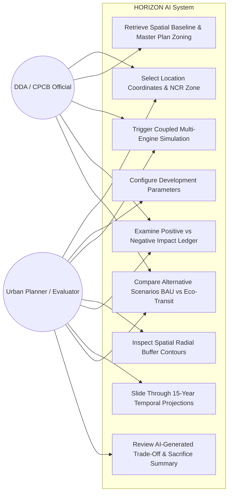
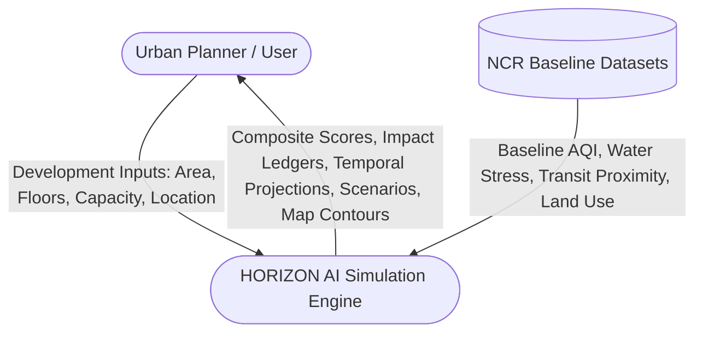
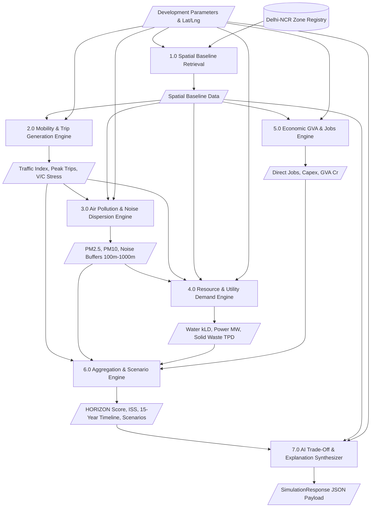

# CSET400C Capstone Project — Milestone-2 Report
**Bennett University | School of Computer Science Engineering and Technology**  
**Course Code:** CSET400C (0-0-12-6) | **Academic Session:** 2026–27  
**Course Coordinator:** Dr. Jabir Ali  
**Deadline:** 23 / 30 November 2026 | **Total Marks:** 30  

---

## Project Title: HORIZON AI
### Autonomous Multi-Dimensional Urban Impact Assessment & Future Simulation Engine for Delhi-NCR

---

## 1. System Architecture & High-Level Design

HORIZON AI follows a modular, decoupled micro-service oriented architecture with clean separation between the presentation layer, the API gateway, the causal computational simulation core, and spatial datasets.

```mermaid
graph TD
    subgraph Client Layer (Next.js 14 + Tailwind CSS)
        UI[Interactive Dashboard]
        MapBox[Mapbox/Leaflet GIS Canvas]
        Ledger[Positive / Negative Impact Ledger]
        Sliders[Temporal Epoch Slider]
        Gauges[Stress Gauges & Radar Metrics]
        Challenge[Mitigation Challenge Drawer]
    end

    subgraph API Gateway Layer (FastAPI)
        Router["/api/simulate | /api/baseline | /api/zones | /api/health"]
        PydanticModels[Pydantic V2 Request & Response Validation Schemas]
    end

    subgraph Causal Simulation Core (Python 3.11)
        SpatialEngine[1. Spatial Baseline Engine]
        MobilityEngine[2. Mobility & Traffic Model]
        PollutionEngine[3. Pollution & Gaussian Plume Model]
        ResourceEngine[4. Resource & Utility Depletion Model]
        EconomicEngine[5. Economic GVA & Jobs Model]
        ScenarioEngine[6. Scenario Synthesizer & Scoring Engine]
        LLMExplainer[7. AI Decision & Sacrifice Synthesizer]
    end

    subgraph Geospatial & Environmental Knowledge Baselines
        OSM[(OpenStreetMap Vector Geodata)]
        MPD[(DDA Draft Master Plan 2041 Spatial Zoning)]
        CPCB[(CPCB National AQI Registry)]
        GTFS[(Delhi Transit GTFS DMRC Metro & Bus)]
        ITE[(ITE Trip Generation Delhi-Adjusted)]
    end

    UI --> Router
    Router --> PydanticModels
    PydanticModels --> SpatialEngine
    SpatialEngine --> OSM
    SpatialEngine --> MPD
    SpatialEngine --> CPCB
    SpatialEngine --> GTFS
    
    SpatialEngine --> MobilityEngine
    MobilityEngine --> ITE
    MobilityEngine --> PollutionEngine
    PollutionEngine --> ResourceEngine
    ResourceEngine --> EconomicEngine
    EconomicEngine --> ScenarioEngine
    ScenarioEngine --> LLMExplainer
    
    LLMExplainer --> Router
    Router --> UI
```

---

## 2. UML Diagrams & Data Flow Models

### 2.1 Use-Case Diagram


### 2.2 Data Flow Diagram (DFD Level 0 — Context Diagram)


### 2.3 Data Flow Diagram (DFD Level 1)


---

## 3. Data Schema & Component Design

The system relies on strict Pydantic v2 schemas defined in `backend/models/development_schema.py`:

### 3.1 Input Models
- **`LocationInput`**: Geocoded coordinates (`lat`, `lng`), address string, and planning `zone_name`.
- **`DevelopmentInput`**: `dev_type` (12 categories: mall, residential, highway, hospital, data_center, etc.), `built_up_area_sqft`, `floors`, `visitor_capacity_daily`, `parking_spaces`, `green_area_hectares`, `operating_hours_per_day`, `construction_duration_months`.

### 3.2 Output Models
- **`SpatialBaselineData`**: Baseline AQI PM2.5/PM10, water stress rating, existing road capacity %, metro and bus proximity in meters, population density.
- **`SpatialBufferMetrics`**: Radial distance buckets (100m, 300m, 500m, 1000m) with distance-decayed PM2.5, PM10, noise (dB), and traffic spillovers.
- **`PositiveImpactItem` & `NegativeImpactItem`**: Itemized impacts with quantified values, category classifications, and severity levels.
- **`DimensionScores`**: 7 normalized sub-scores (Economic, Social, Environmental, Mobility, Resources, Infrastructure, Climate Resilience).
- **`TemporalPoint`**: Multi-year trajectories for Years 2026, 2028, 2031, 2036, and 2041.
- **`ScenarioOutput`**: 3 counterfactual futures with net utility scores and policy modifications.
- **`SimulationResponse`**: Root response enclosing scores, explainers, data sources, and confidence index.

---

## 4. Working Prototype / MVP Implementation Evidence

### 4.1 Implemented Modules Breakdown
1. **Backend Service Layer (`backend/services/`)**:
   - `spatial_engine.py`: Encapsulates 10 Delhi-NCR spatial zones with geofences, baseline AQI, transit nodes, and DDA Master Plan 2041 zoning overlays.
   - `mobility_model.py`: Calculates trip generation rates, peak-hour surges, and road capacity degradation.
   - `pollution_model.py`: Implements spatial Gaussian-style dispersion buffers across 100m–1000m radii.
   - `resource_model.py`: Estimates water demand (kLD), groundwater stress rating, peak power load (MW), and solid waste.
   - `economic_model.py`: Estimates Capex (₹ Cr), annual Opex, direct/indirect employment, and municipal property tax yield.
   - `scenario_engine.py`: Aggregates the composite HORIZON Score (0–100), Infrastructure Stress Index (ISS 0–100), builds temporal time-series, and counterfactual scenario variants.
   - `llm_explainer.py`: Synthesizes plain-language executive trade-offs, explicit sacrifices, and actionable mitigation measures.

2. **Frontend UI Dashboard (`frontend/src/`)**:
   - `MapContainer.tsx`: Interactive Leaflet/Mapbox vector map showing development anchors, spatial buffer radiuses, transit lines, and zone polygons.
   - `FormDrawer.tsx`: Dynamic configuration drawer for selecting typology, sizing, capacity, and green buffers.
   - `PositiveNegativeLedger.tsx`: Dual-panel comparative breakdown showing quantifiable gains versus environmental sacrifices.
   - `StressGauge.tsx` & `RadarMetrics.tsx`: Real-time visual meters for ISS (Infrastructure Stress Index) and multi-dimensional balance.
   - `TemporalTimeline.tsx`: Interactive slider projecting 15-year future trajectories (2026–2041).
   - `ChallengeDrawer.tsx`: Counterfactual scenario selector allowing planners to test green mitigations on the fly.

---

## 5. Milestone-2 Test Cases & Initial Validation Plan

The following test suites are established to satisfy the Milestone-2 testing criterion:

| Test Suite ID | Target Component | Validation Objective | Expected Behavior |
| :--- | :--- | :--- | :--- |
| **TC-01** | `spatial_engine.py` | Coordinate-to-zone nearest mapping | Correctly identifies Noida Sector 62, Cyber City, Dwarka Corridor. |
| **TC-02** | `mobility_model.py` | Trip generation by typology | Commercial mall generates higher peak vehicle trips than school or solar farm. |
| **TC-03** | `pollution_model.py` | Radial buffer decay | PM2.5 and noise pollution decrease monotonically from 100m to 1000m. |
| **TC-04** | `resource_model.py` | Water stress critical threshold | Exceeding 150 kLD in a Critical aquifer zone triggers a "Critical" drawdown flag. |
| **TC-05** | `economic_model.py` | Capex & Jobs proportionality | Larger built-up area generates proportionally higher Capex and employment. |
| **TC-06** | `scenario_engine.py` | Score normalization | HORIZON Score and ISS always remain strictly bounded between 0.0 and 100.0. |
| **TC-07** | `api/simulate` | End-to-end integration latency | API handles standard payload and returns within 500ms with HTTP 200. |

---

## 6. Completed Work vs Remaining Work for Final Evaluation

### Completed Work (Milestone-2)
- [x] Full core causal simulation backend (7 modular microservices).
- [x] Pydantic v2 validation and error handling for all development parameters.
- [x] Responsive Next.js frontend with live map, gauges, ledgers, and sliders.
- [x] Integration with Delhi-NCR geospatial baseline points and Master Plan 2041 zoning.
- [x] Dynamic counterfactual scenario generator and AI explainer.

### Remaining Work for Final Evaluation
- [ ] Implement automated unit and regression test suite (`pytest`) in backend.
- [ ] Conduct latency and load benchmarking under concurrent simulation requests.
- [ ] Validate simulated PM2.5 and traffic spikes against published CPCB/DDA historical case studies.
- [ ] Compile the final 20–40 page Capstone Project Report following Section 12 formatting guidelines.
- [ ] Prepare final presentation slide deck and rehearsed live demonstration script.

---
*End of Milestone-2 Specification Document.*
